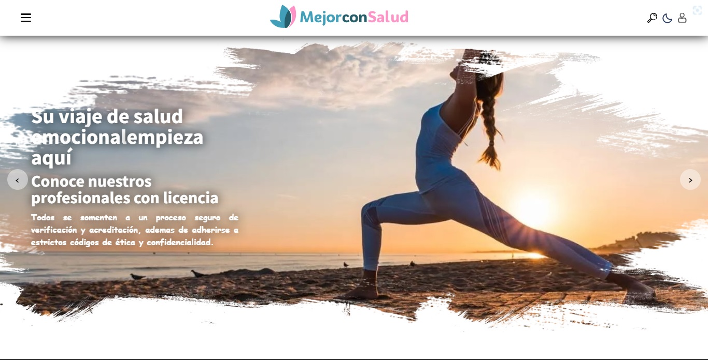
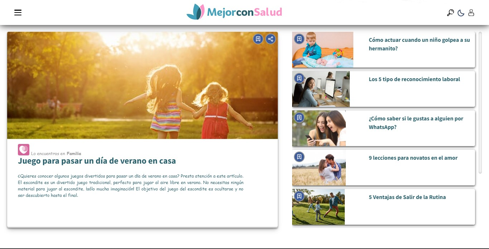
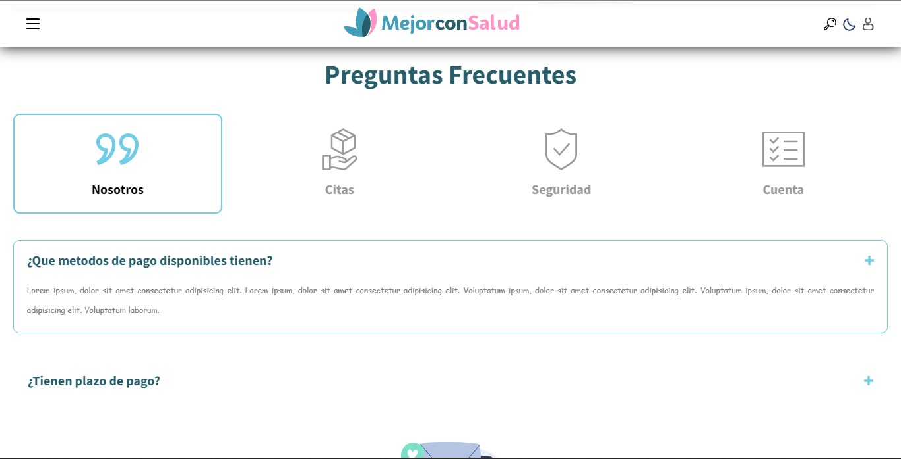
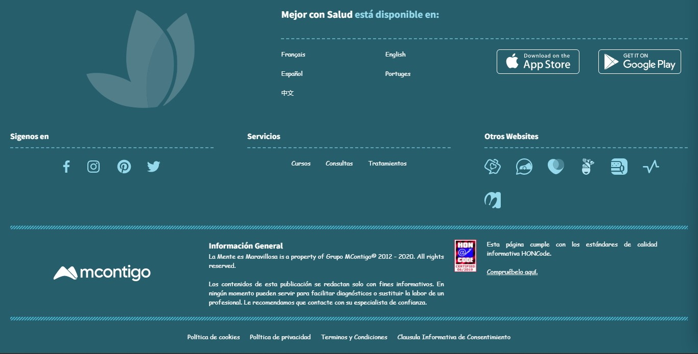
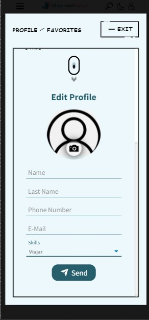
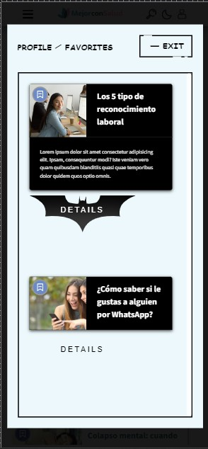
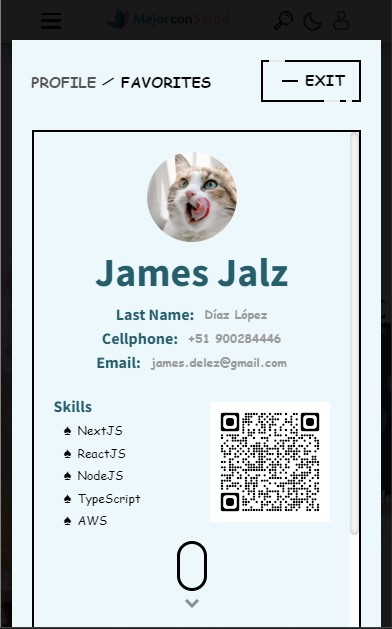

<h1 align="center"> Prueba Técnica ATOMIK</h1>

---

<h2 align="center"><a href="https://jalzdelezz.github.io/frontend-dev-challenge/">Click Me! 👀 Deployment 🔥</a></h2>

## Tabla de contenidos:

---

- Responsive Design 100% ✅
- BEM nomenclature ✅
- Navigation Menu ✅
- Box Slider ✅
- Modal ✅
- Form ✅
- FAQ ✅

- Plus [GitHubActions, SCSS(*), ReactJS, Simulation of MicroServices]

### Componentes:
---
<ul style="list-style: none">
    <h2>View Code 💻🈵👀<h4>
    <li>
        

            
 Carousel 

            
                
        

    </li>
    <li>
        

            
 Portal 

            

                
            

        
 
    </li>
    <li>
        

            
 Sliders 

                
        
 
    </li>
    <li> 
        

            
 Custom Buttons 

            

                
            

        
 
    </li>
    <li> 
        

            
 Favorites 

            

                
            

        
 
    </li>
</ul>

### Colores de componente 🎨:
---
<ul>
    <li>$base-neutral: #419fb9;</li>
    <li>$base-dark-mode : rgb(58, 58, 58);</li>
    <li>$base-pink: #ff93c7; </li>
    <li>$input-base : #71CCE5;</li>
</ul>

### Destacados 🌟: 
---

